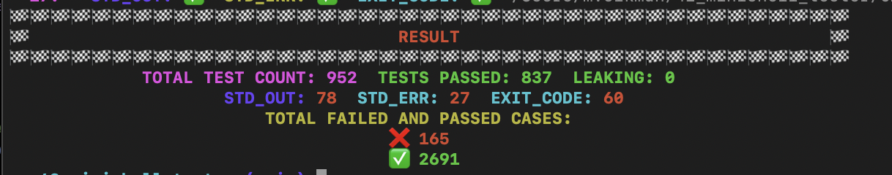

# MINISHELL

A first group project of 42. First massive project, probably one of the most challanging project from the 42 core curriculum.

## IDEA

The project consists of two main parts: `PARSING` and `EXECUTING`. I worked on the execution part. It’s worth mentioning that we were limited in terms of the functions and libraries we could use, as specified in the subject.

The main logic was as follows: the parsing part checked if everything was correct regarding commands, command options, pipes, and redirections. If everything was valid, we saved the commands in a linked list structure:

Additionally, we had to save environment variables (ENV) within our own structure because we needed to use our own implementation of ENV rather than relying on Bash's. This allowed us to dynamically add or remove environment variables when required in our shell.

To execute commands, we utilized the `execve` function. This required understanding and implementing parent and child processes. Parent processes were responsible for managing the overall execution, while child processes handled individual commands. This division was critical for handling features like pipes (`|`) and redirections (`<`, `<<`, `>`, `>>`).

Another key part of the project was implementing our own built-in commands. These included:

- `echo` with the `-n` option
- `cd` with only a relative or absolute path
- `pwd` with no options
- `export` with no options
- `unset` with no options
- `env` with no options or arguments
- `exit` with no options

The built-ins required careful consideration of functionality and edge cases, such as handling invalid inputs or updating environment variables dynamically.

Overall, the project was not just about writing a shell but also about understanding how processes, file descriptors, and system calls work. By tackling challenges like process management, custom environments, and built-ins, we gained a deeper appreciation for how shells operate under the hood.

## What I Learned

One cool thing about building something like `minishell` is that it really helps you become comfortable using the terminal. When you understand what happens when you run commands and something doesn’t work, you can figure out why. It was also fascinating to learn how pipes (`|`) and redirections (`<`, `<<`, `>`, `>>`) work. Another important thing I learned was how child and parent processes work with different commands and why parent/child processes are necessary, as well as discovering many new commands I had never tried before.

The project itself was challenging. It took two months to complete and get evaluated, but I enjoyed it and learned a lot in the process.

## TESTER:

There is no official tester for `minishell`, so all available testers are created by fellow students. We decided to use a tester I would call a "big boy tester." This tester includes many additional tests that are not mandatory for the project. Passing around 50% of these tests is generally enough to meet the requirements and pass the `minishell` project.

The score we got:

Tester link: https://github.com/zstenger93/42_minishell_tester
